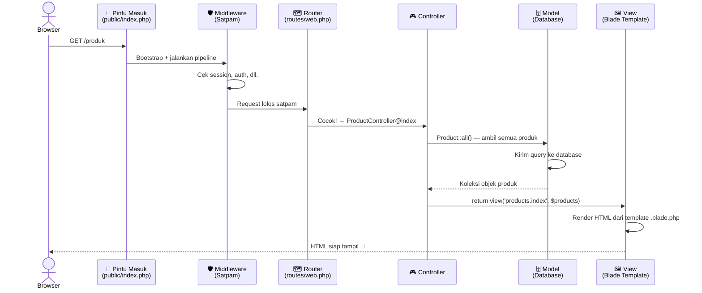
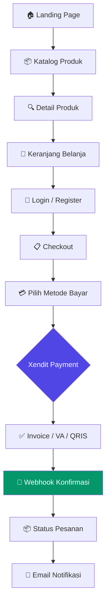
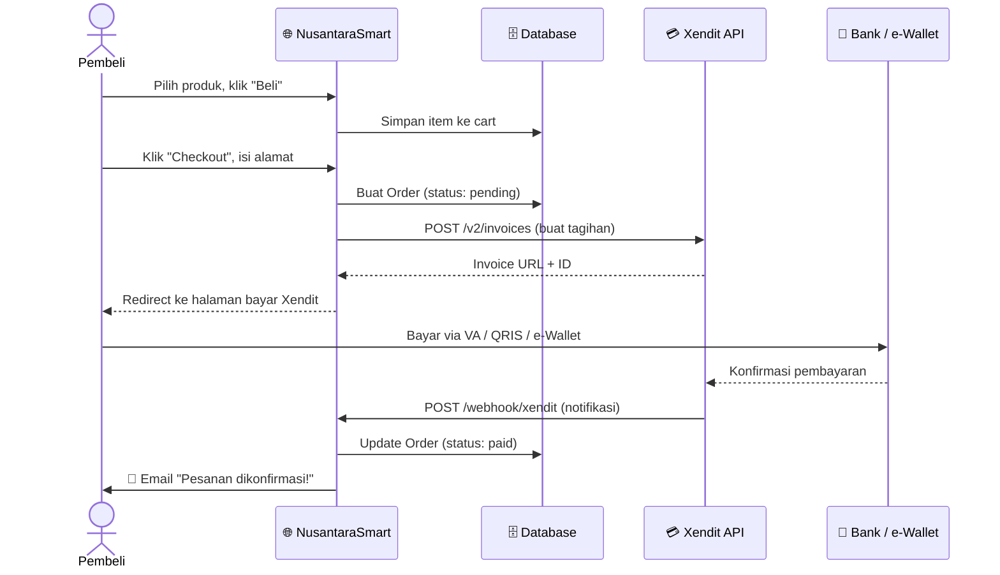

# 🇮🇩 NusantaraSmart — Panduan Laravel untuk Online Shop + Xendit

> **Buat kamu yang mau bangun e-commerce fullstack tapi masih bingung cara kerja Laravel.**
> Santai, kita bahas dari nol — dengan diagram, analogi sederhana, dan sedikit bumbu biar nggak ngantuk. 😄

---

## 📋 Daftar Isi

1. [Gambaran Besar: Laravel Itu Apa Sih?](#1-gambaran-besar-laravel-itu-apa-sih)
2. [Struktur Folder Proyek Ini](#2-struktur-folder-proyek-ini)
3. [Cara Kerja Laravel: Perjalanan Sebuah Request](#3-cara-kerja-laravel-perjalanan-sebuah-request)
4. [Pola MVC — Trio yang Selalu Bersama](#4-pola-mvc--trio-yang-selalu-bersama)
5. [Rencana Fitur Online Shop NusantaraSmart](#5-rencana-fitur-online-shop-nusantarasmart)
6. [Alur E-Commerce End-to-End](#6-alur-e-commerce-end-to-end)
7. [Integrasi Xendit: Bayar, Done!](#7-integrasi-xendit-bayar-done)
8. [Cara Mulai (Quick Start)](#8-cara-mulai-quick-start)
9. [Kamus Istilah Tech](#9-kamus-istilah-tech)

---

## 1. Gambaran Besar: Laravel Itu Apa Sih?

Bayangkan kamu buka warung makan. Ada **kasir** (menerima pesanan), **dapur** (mengolah pesanan), dan **pramusaji** (menyajikan ke meja). Laravel bekerja persis seperti itu — setiap bagian punya peran yang jelas.

**Laravel** adalah *framework* PHP yang menyediakan "kerangka" standar supaya kamu nggak harus nulis semuanya dari nol. Ibaratnya, kalau PHP itu bahan bangunan, Laravel itu kontraktor yang sudah menyiapkan pondasi, dinding, dan atap — kamu tinggal dekorasi.

**Proyek ini** (`NusantaraSmart`) adalah *skeleton* (kerangka kosong) Laravel 12 yang siap dikembangkan menjadi platform online shop dengan pembayaran Xendit.

---

## 2. Struktur Folder Proyek Ini

```
NusantaraSmart/
│
├── 📁 app/                    ← Otak aplikasi kamu
│   ├── 📁 Http/
│   │   ├── 📁 Controllers/    ← "Manajer" yang menerima request & memutuskan apa yang harus dilakukan
│   │   ├── 📁 Middleware/     ← "Satpam" yang memeriksa request sebelum masuk
│   │   └── 📁 Requests/       ← Validasi data yang masuk (nanti dibuat)
│   ├── 📁 Models/             ← Representasi tabel database dalam bentuk objek PHP
│   │   └── User.php           ← Model user (sudah ada dari bawaan)
│   ├── 📁 Services/           ← Logika bisnis kompleks (nanti dibuat, contoh: XenditService)
│   └── 📁 Providers/          ← Konfigurasi awal ketika aplikasi nyala
│
├── 📁 bootstrap/              ← "Tombol start" Laravel, jangan diutak-atik
│   └── app.php                ← Titik awal konfigurasi aplikasi
│
├── 📁 config/                 ← Semua pengaturan aplikasi (database, mail, dll.)
│   ├── app.php                ← Pengaturan umum (nama app, timezone, locale)
│   ├── database.php           ← Koneksi database
│   ├── services.php           ← Konfigurasi service pihak ketiga (Xendit masuk sini)
│   └── ...
│
├── 📁 database/               ← Semua urusan database
│   ├── 📁 migrations/         ← "Blueprint" struktur tabel (versi kontrol untuk database)
│   ├── 📁 seeders/            ← Data awal untuk development (contoh produk, user dummy)
│   └── 📁 factories/          ← Generator data palsu untuk testing
│
├── 📁 public/                 ← Satu-satunya folder yang bisa diakses langsung dari internet
│   └── index.php              ← Pintu masuk SEMUA request ke Laravel
│
├── 📁 resources/              ← Semua yang tampil di layar browser
│   ├── 📁 views/              ← Template HTML (file .blade.php)
│   │   └── welcome.blade.php  ← Halaman selamat datang bawaan
│   ├── 📁 css/                ← Stylesheet
│   └── 📁 js/                 ← JavaScript (diproses oleh Vite)
│
├── 📁 routes/                 ← Peta jalan semua URL aplikasi
│   ├── web.php                ← Route untuk halaman web biasa (ada session, cookie)
│   └── console.php            ← Perintah artisan kustom
│
├── 📁 storage/                ← Tempat simpan file upload, log, cache — jangan di-commit!
│
├── 📁 tests/                  ← Unit test & Feature test
│
├── .env.example               ← Template konfigurasi rahasia (copy jadi .env)
├── artisan                    ← CLI ajaib Laravel (php artisan ...)
├── composer.json              ← Daftar dependensi PHP
├── package.json               ← Daftar dependensi JavaScript (Vite, Tailwind, dll.)
└── vite.config.js             ← Konfigurasi bundler aset (JS & CSS)
```

### 🗂️ Diagram Folder Penting

```
┌─────────────────────────────────────────────────────────────┐
│                    LAYER PRESENTASI                         │
│  resources/views/  →  File .blade.php  →  HTML ke browser  │
└──────────────────────────────┬──────────────────────────────┘
                               │
┌──────────────────────────────▼──────────────────────────────┐
│                     LAYER APLIKASI                          │
│  routes/web.php  →  Controllers  →  Services/Models         │
└──────────────────────────────┬──────────────────────────────┘
                               │
┌──────────────────────────────▼──────────────────────────────┐
│                     LAYER DATA                              │
│  Models (Eloquent)  →  Database (MySQL/SQLite)              │
└─────────────────────────────────────────────────────────────┘
```

---

## 3. Cara Kerja Laravel: Perjalanan Sebuah Request

Bayangkan kamu mengetik `https://nusantarasmart.com/produk` di browser. Apa yang terjadi di balik layar?



### Versi Singkat (5 Langkah):

| # | Komponen | Analogi | Tugas |
|---|----------|---------|-------|
| 1 | `public/index.php` | Resepsionis hotel | Terima semua tamu (request), arahkan ke dalam |
| 2 | **Middleware** | Satpam | "Sudah login? Ada izin?" |
| 3 | **Router** (`routes/web.php`) | Peta gedung | Cocokkan URL ke handler yang tepat |
| 4 | **Controller** | Manajer | Koordinasi: ambil data, proses, kirim ke view |
| 5 | **View** (Blade) | Desainer interior | Render HTML yang cantik untuk dikirim ke browser |

---

## 4. Pola MVC — Trio yang Selalu Bersama

Laravel menggunakan pola **MVC** *(Model–View–Controller)*. Ini cara memisahkan tanggung jawab agar kode tidak berantakan.

```
┌──────────┐     request      ┌─────────────┐
│          │ ──────────────→  │             │
│  BROWSER │                  │  CONTROLLER │
│          │ ←──────────────  │             │
└──────────┘     response     └──────┬──────┘
                                     │  ↕ koordinasi
                          ┌──────────┴──────────┐
                          │                     │
                    ┌─────▼──────┐      ┌───────▼──────┐
                    │            │      │              │
                    │   MODEL    │      │    VIEW      │
                    │            │      │              │
                    │ Bicara ke  │      │ Render HTML  │
                    │ database   │      │ (Blade file) │
                    └─────┬──────┘      └──────────────┘
                          │
                    ┌─────▼──────┐
                    │  DATABASE  │
                    │ (MySQL /   │
                    │  SQLite)   │
                    └────────────┘
```

| Komponen | File | Tugasnya |
|----------|------|----------|
| **Model** | `app/Models/Product.php` | Representasi tabel `products`, punya method untuk query |
| **View** | `resources/views/products/index.blade.php` | Template HTML, terima data dari controller |
| **Controller** | `app/Http/Controllers/ProductController.php` | Ambil data dari Model, kirim ke View |

### Contoh Nyata: Halaman Daftar Produk

```php
// routes/web.php — daftarkan URL-nya
Route::get('/produk', [ProductController::class, 'index']);

// app/Http/Controllers/ProductController.php — Controller
public function index()
{
    $products = Product::where('is_active', true)->latest()->get(); // tanya ke Model
    return view('products.index', compact('products'));              // kirim ke View
}

// app/Models/Product.php — Model
class Product extends Model
{
    protected $fillable = ['name', 'price', 'stock', 'image', 'description'];
}

// resources/views/products/index.blade.php — View
@foreach ($products as $product)
    <div class="product-card">
        <h2>{{ $product->name }}</h2>
        <p>Rp {{ number_format($product->price) }}</p>
    </div>
@endforeach
```

---

## 5. Rencana Fitur Online Shop NusantaraSmart

Berikut komponen yang perlu dibangun beserta file yang harus dibuat:



### Tabel Fitur → File yang Dibuat

| Fitur | Models | Controllers | Views | Routes |
|-------|--------|-------------|-------|--------|
| Produk | `Product.php` | `ProductController` | `products/*` | `web.php` |
| Keranjang | `Cart.php` | `CartController` | `cart/*` | `web.php` |
| Order | `Order.php`, `OrderItem.php` | `OrderController` | `orders/*` | `web.php` |
| Pembayaran | `Payment.php` | `PaymentController` | `payment/*` | `web.php` |
| Auth | (bawaan) | (via Breeze/Jetstream) | `auth/*` | otomatis |
| Admin | — | `Admin/ProductController` | `admin/*` | `web.php` (group middleware) |

---

## 6. Alur E-Commerce End-to-End



### Status Order yang Perlu Dibuat

```
pending  →  paid  →  processing  →  shipped  →  delivered
   ↓
cancelled  (jika tidak bayar dalam X jam, otomatis batal)
```

---

## 7. Integrasi Xendit: Bayar, Done!

Xendit adalah *payment gateway* Indonesia yang mendukung Transfer Bank, Virtual Account, QRIS, GoPay, OVO, Dana, dan kartu kredit.

### Langkah Integrasi

#### Step 1 — Install Xendit SDK

```bash
composer require xendit/xendit-php
```

#### Step 2 — Simpan API Key di `.env`

```dotenv
XENDIT_SECRET_KEY=xnd_development_xxxxxxxxxxxx
XENDIT_WEBHOOK_TOKEN=your_webhook_verification_token
XENDIT_SUCCESS_URL=https://nusantarasmart.com/payment/success
XENDIT_FAILURE_URL=https://nusantarasmart.com/payment/failed
```

#### Step 3 — Tambahkan ke `config/services.php`

```php
'xendit' => [
    'secret_key'     => env('XENDIT_SECRET_KEY'),
    'webhook_token'  => env('XENDIT_WEBHOOK_TOKEN'),
    'success_url'    => env('XENDIT_SUCCESS_URL'),
    'failure_url'    => env('XENDIT_FAILURE_URL'),
],
```

#### Step 4 — Buat Service Class

```php
// app/Services/XenditService.php
namespace App\Services;

use Xendit\Xendit;
use Xendit\Invoice\InvoiceApi;

class XenditService
{
    protected InvoiceApi $invoiceApi;

    public function __construct()
    {
        Xendit::setApiKey(config('services.xendit.secret_key'));
        $this->invoiceApi = new InvoiceApi();
    }

    public function createInvoice(Order $order): array
    {
        $params = [
            'external_id'        => 'order-' . $order->id,
            'amount'             => $order->total_amount,
            'description'        => 'Pembayaran Order #' . $order->order_number,
            'payer_email'        => $order->user->email,
            'success_redirect_url' => config('services.xendit.success_url'),
            'failure_redirect_url' => config('services.xendit.failure_url'),
            'currency'           => 'IDR',
        ];

        return $this->invoiceApi->createInvoice($params);
    }
}
```

#### Step 5 — Controller Pembayaran

```php
// app/Http/Controllers/PaymentController.php
public function createPayment(Order $order)
{
    $xendit   = new XenditService();
    $invoice  = $xendit->createInvoice($order);

    // Simpan ID invoice ke database
    $order->update([
        'xendit_invoice_id' => $invoice['id'],
        'payment_url'       => $invoice['invoice_url'],
    ]);

    // Redirect pembeli ke halaman bayar Xendit
    return redirect($invoice['invoice_url']);
}

// Webhook — dipanggil otomatis oleh Xendit setelah bayar
public function handleWebhook(Request $request)
{
    // Verifikasi token dari header X-CALLBACK-TOKEN
    $token = $request->header('X-CALLBACK-TOKEN');
    if ($token !== config('services.xendit.webhook_token')) {
        return response('Unauthorized', 401);
    }

    $data  = $request->all();
    $order = Order::where('xendit_invoice_id', $data['id'])->firstOrFail();

    if ($data['status'] === 'PAID') {
        $order->update(['status' => 'paid']);
        // Kirim email notifikasi, kurangi stok, dll.
        OrderPaidJob::dispatch($order);
    }

    return response('OK', 200);
}
```

#### Step 6 — Daftarkan Route Webhook (tanpa CSRF!)

```php
// routes/web.php
use App\Http\Controllers\PaymentController;

// Route biasa (butuh auth)
Route::middleware('auth')->group(function () {
    Route::post('/payment/create/{order}', [PaymentController::class, 'createPayment'])
         ->name('payment.create');
});

// Webhook dari Xendit — TIDAK pakai CSRF karena dipanggil server Xendit
Route::post('/webhook/xendit', [PaymentController::class, 'handleWebhook'])
     ->withoutMiddleware([\Illuminate\Foundation\Http\Middleware\VerifyCsrfToken::class])
     ->name('webhook.xendit');
```

### Diagram Alur Pembayaran Xendit

```
Pembeli klik "Bayar"
        │
        ▼
PaymentController::createPayment()
        │
        ├── Buat Invoice via Xendit API
        │       POST https://api.xendit.co/v2/invoices
        │
        ├── Simpan invoice_id ke tabel orders
        │
        └── Redirect ke invoice_url (halaman bayar Xendit)
                │
                ▼
        Pembeli bayar (VA / QRIS / Wallet)
                │
                ▼
        Xendit kirim notifikasi ke webhook kamu
        POST https://nusantarasmart.com/webhook/xendit
                │
                ▼
        PaymentController::handleWebhook()
                │
                ├── Verifikasi token header
                ├── Update status order → "paid"
                └── Dispatch job: kirim email, kurangi stok
```

---

## 8. Cara Mulai (Quick Start)

```bash
# 1. Clone & masuk ke folder
git clone https://github.com/raihanvst/NusantaraSmart.git
cd NusantaraSmart

# 2. Install dependensi PHP dan JavaScript + setup awal
composer run setup

# 3. Sesuaikan konfigurasi database & Xendit
cp .env.example .env
# Edit .env: isi DB_DATABASE, DB_USERNAME, DB_PASSWORD, XENDIT_SECRET_KEY, dll.

# 4. Jalankan development server (semua sekaligus!)
composer run dev
# Buka: http://localhost:8000

# 5. Perintah artisan yang sering dipakai
php artisan make:model Product -mcr        # Model + Migration + Controller (resource)
php artisan make:migration create_orders_table
php artisan migrate                         # Jalankan migrasi
php artisan db:seed                         # Isi data awal
php artisan tinker                          # REPL interaktif untuk testing
php artisan route:list                      # Lihat semua route yang terdaftar
```

### Urutan Membangun Fitur Baru

```
1. php artisan make:migration create_[nama]_table
      ↓ (definisikan kolom di file migration)
2. php artisan migrate
      ↓
3. php artisan make:model [Nama] -mc
      ↓ (isi $fillable, relasi, dll.)
4. Tambahkan route di routes/web.php
      ↓
5. Isi logika di Controller
      ↓
6. Buat template di resources/views/
      ↓
7. Test di browser / php artisan test
```

---

## 9. Kamus Istilah Tech

> Nggak perlu hafal semua sekaligus — cukup baca kalau ketemu istilah yang asing.

| Istilah | Artinya dalam bahasa manusia |
|---------|------------------------------|
| **Framework** | Kerangka siap pakai yang menyediakan struktur dan tools standar, jadi kamu nggak mulai dari nol |
| **MVC** | Pola pemisahan kode: **M**odel (data), **V**iew (tampilan), **C**ontroller (logika penghubung) |
| **Route** | Peta URL — "kalau ada yang buka `/produk`, jalankan fungsi ini" |
| **Controller** | File PHP yang menangani logika: ambil data dari Model, kirim ke View |
| **Model** | Representasi tabel database dalam bentuk objek PHP (pakai Eloquent ORM) |
| **Eloquent ORM** | Cara Laravel bicara ke database tanpa nulis SQL mentah. `Product::all()` = `SELECT * FROM products` |
| **Migration** | Versi kontrol untuk struktur database — bisa dibuat ulang, di-rollback, dll. |
| **Seeder** | Script untuk mengisi database dengan data awal/dummy saat development |
| **Middleware** | Lapisan "penjaga" yang dijalankan sebelum request sampai ke Controller (cek login, cek role, dll.) |
| **Blade** | Template engine Laravel. File `.blade.php` = HTML + sintaks PHP yang lebih bersih (`{{ }}`, `@if`, `@foreach`) |
| **Artisan** | CLI (command line interface) bawaan Laravel. `php artisan make:model` = bikin file otomatis |
| **Composer** | Package manager PHP, mirip `npm` untuk JavaScript. Dipakai untuk install library |
| **Vite** | Tool yang memproses/menggabungkan file CSS & JavaScript agar lebih cepat dimuat browser |
| **Webhook** | URL di aplikasi kamu yang dipanggil oleh server lain (misal Xendit) untuk memberi notifikasi otomatis |
| **API Key** | "Kata sandi" rahasia yang dipakai untuk mengakses layanan pihak ketiga seperti Xendit |
| **Payment Gateway** | Perantara pembayaran online — Xendit, Midtrans, Stripe adalah contohnya |
| **Queue / Job** | Antrian tugas yang diproses di background (kirim email, resize gambar, dll.) agar web tetap cepat |
| **Facade** | Cara akses fitur Laravel secara singkat dan mudah dibaca, seperti `Route::get(...)`, `DB::table(...)` |
| **Service Provider** | "Kode booting" yang dijalankan saat Laravel pertama nyala — tempat daftarkan binding kelas, config, dll. |
| **Environment (.env)** | File konfigurasi rahasia (password DB, API key, dll.) yang TIDAK boleh di-commit ke Git |
| **CSRF Token** | Token keamanan yang mencegah serangan dari form berbahaya di situs lain |
| **Fullstack** | Kamu mengerjakan semuanya: tampilan depan (frontend) dan logika server (backend) |
| **E2E (End-to-End)** | Alur lengkap dari ujung ke ujung — dari pembeli klik produk sampai pesanan selesai dikirim |

---

> 💡 **Tips:** Mulai dari yang kecil. Buat satu fitur utuh (contoh: halaman produk) dulu — dari migration, model, controller, sampai view. Setelah paham polanya, fitur berikutnya akan jauh lebih cepat.
>
> **Stack yang direkomendasikan untuk proyek ini:**
> - 🎨 **Frontend**: [Tailwind CSS](https://tailwindcss.com) + [Alpine.js](https://alpinejs.dev) (ringan, cocok untuk Laravel)
> - 🔐 **Auth**: `php artisan breeze:install` (paling simpel, sudah include login/register/reset password)
> - 💳 **Payment**: [xendit/xendit-php](https://github.com/xendit/xendit-php)
> - 📧 **Email**: [Mailtrap](https://mailtrap.io) untuk dev, Gmail/Resend untuk production
